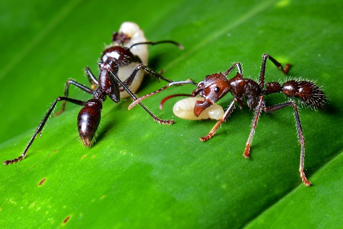

# isula


[](https://packagecloud.io/cgavidia/isula)
[](https://sonarcloud.io/summary/new_code?id=isula)

<p style="text-align:center">
  <a href="https://cptanalatriste.github.io/isula/">
    
  </a>
</p>

## About

Ant Colony Optimisation (ACO) is an algorithmic framework for solving
combinatorial optimisation problems.
Algorithms in the framework imitate the foraging behaviour of ants.
Ants in the wild traverse a terrain looking for food, while depositing
pheromones over the path they take.
Pheromone is a chemical substance attractive to ants.
Efficient ants find shorter paths, making more trips from the food source to
the colony than fellow ants on longer routes.
This produces an accumulation of pheromone over short paths, getting the
attention of the rest the colony.
Over time, the whole colony converges towards the shortest path found.

In a similar fashion, artificial ants in ACO algorithms traverse the solution
space of an optimisation problem, depositing pheromone over the components
of the solution they built.
The amount of pheromone is proportional to the quality of their
solution, so pheromone accumulates in the most valuable solution components.
Over time, ants in the artificial colony converge to high-quality solutions
for a given optimisation problem.
Isula allows an easy implementation of Ant-Colony Optimisation algorithms using the Java Programming Language.
It contains the common elements present in the meta-heuristic, to allow algorithm designers the reutilization of
behaviors.
With Isula, solving optimisation problems with Ant Colony can be done in few lines of code.

## Usage

### Setup

The code uploaded to this GitHub Repository corresponds to a Maven Java Project.
As such, it is strongly recommended that you have Maven installed before working with Isula.

You can use Isula as a dependency on your own Ant Colony Optimization project, by adding the following
to your `pom.xml` file:

```xml

<repositories>
    <repository>
        <id>isula</id>
        <url>https://packagecloud.io/cgavidia/isula/maven2
        </url>
    </repository>
</repositories>
<dependencies>
<dependency>
    <groupId>isula</groupId>
    <artifactId>isula</artifactId>
    <version>2.1.2</version>
</dependency>
</dependencies>
```

### Algorithm Configuration

To solve a problem with an Ant-Colony Optimization algorithm, you need a colony of agents (a.k.a. ants), a graph
representing the problem, and a pheromone data-structure to allow communication between these agents.
Isula tries to emulate that pattern:

```java
TspProblemConfiguration configurationProvider=new TspProblemConfiguration(problemRepresentation);
        AntColony<Integer, TspEnvironment> colony=getAntColony(configurationProvider);
        TspEnvironment environment=new TspEnvironment(problemRepresentation);

        AcoProblemSolver<Integer, TspEnvironment> solver=new AcoProblemSolver<>();
        solver.initialize(environment,colony,configurationProvider);
        solver.addDaemonActions(new StartPheromoneMatrix<Integer, TspEnvironment>(),
        new PerformEvaporation<Integer, TspEnvironment>());

        solver.addDaemonActions(getPheromoneUpdatePolicy());

        solver.getAntColony().addAntPolicies(new RandomNodeSelection<Integer, TspEnvironment>());
        solver.solveProblem();
```

That's a snippet from [our Travelling Salesman Problem solution](https://github.com/cptanalatriste/aco-tsp).
Some things to notice there:

* Problem and algorithm configuration are provided by `ConfigurationProvider` instances.
  Make your own with the values you need.
* The class that does most of the job is `AcoProblemSolver`.
  In this case, we're using the same one provided by the framework but you can extend it to suit your needs.
* The `ProblemSolver` needs an `Environment` that manages the problem graph and the pheromone matrix.
  You need to extend the `Environment` class provided by the framework to adjust it to your problem.
* And we need an `AntColony`. The `AntColony` main responsibility is to create Ants, and make them built solutions
  in iterations. The base `AntColony` class makes implementing this very easy.
* The heart of the algorithm is the `Ant` class. You will need to define an `Ant` that suits your needs.
* Isula supports daemon actions (global behaviors) and ant-level policies, such as the ones present in
  multiple ACO Algorithms. You can add daemon actions to a solver via the `addDaemonActions` method and ant policies
  to a colony via the `addAntPolicies` method.
* Finally, you call the `solveProblem()` method and wait for the best solution to be obtained.

### Isula Workflow

Here is a sequence diagram of the `solveProblem()` method, for you to get an idea on how isula works:


<p style="text-align:center">
  <a href="https://cptanalatriste.github.io/isula/">
    
  </a>
</p>

Isula will provide you the basic execution flow for an algorithm in the ACO metaheuristic. Usually, you
can rely on the implementations already available for `AcoProblemSolver` and `AntColony` but you are free to override
and extend in case you need it. Take in mind that you will need to create your own `Ant` instance for
custom problems, however the base implementation already contains a lot of functionality available.
If you need some reference, please take a look to the projects on the "Examples" section.

Every ACO algorithm has a set of customized behaviours that are executed during the solution processes: this behaviours
can have global impact (`DaemonAction` instances, like pheromone update rules) or only affect an ant and its solution
(like component selection rules: they are subclasses of `AntPolicy`). Isula already provides these behaviours for some
representative algorithms (take a look at the `isula.aco.algorithms` package) ,but you might need to define
your own policies or extend the ones already available.

## Examples

If you are not familiar with the framework, a good place to start is the classic Travelling Salesman Problem:

* [The Travelling Salesman Problem, using Ant System](https://github.com/cptanalatriste/aco-tsp).
* [The Travelling Salesman Problem, using Ant Colony System](https://github.com/cptanalatriste/aco-acs-tsp).

Here are some advanced examples of optimization problems solved with Isula-based algorithms:

* [Flow-Shop Scheduling Problem, using Max-Min Ant System](https://github.com/cptanalatriste/aco-flowshop).
* [Unicost Set Covering Problem, using a parallelization strategy](https://github.com/cptanalatriste/aco-set-covering)
* [Binary Image Segmentation using Ant System](https://github.com/cptanalatriste/aco-image-thresholding).
* [Image Clustering using Max-Min Ant System](https://github.com/cptanalatriste/aco-image-segmentation)

## Resources

* [The JavaDoc of every class on the framework](https://cptanalatriste.github.io/isula/apidocs/).
* [Our paper in the SoftwareX journal](https://www.sciencedirect.com/science/article/pii/S2352711019300639), for an
  in-depth discussion of the framework and its features.
* [A video of our tutorial at GECCO 2022](https://www.youtube.com/watch?v=gHB-7J_TDmk), where we describe how
  to use Isula to solve the Unicost Set Covering Problem.
* [A Medium article](https://medium.com/@cgavidia/the-travelling-sales-ant-problem-6a4f5d046a2b), discussing
  how to solve the Travelling Salesman Problem using brute-force and an Isula-based ACO algorithm.
* [A CodeProject article](http://www.codeproject.com/Articles/1011148/A-Java-Primer-of-Ant-Colony-Algorithms),
  where Ant Colony Optimization algorithms are discussed and Isula is used to implement them.

## Support

Feel free to contact me [via email](mailto:carlos.gavidia@pucp.edu.pe), or create a GitHub Issue here.
